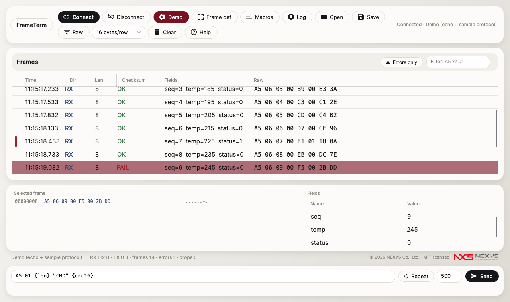

# FrameTerm

**A byte-oriented serial protocol workbench.** Define your frame once, and every byte on the wire becomes a parsed, checksum-verified, color-coded record. No scripting required.

> 바이트 지향 시리얼 프로토콜 워크벤치입니다. 구분자/고정길이/길이필드/침묵갭 4가지 프레이밍 모드로 프레임을 선언하면, 수신 스트림이 자동으로 프레임 단위로 잘리고 CRC 검증(OK/FAIL 색상 표시), 필드 파싱, 하이라이트까지 한 번에 처리됩니다. 스크립트 없이 동작하며 Windows/macOS/Linux를 지원합니다.



*Demo mode: the built-in sample protocol streaming through the pipeline — checksum OK/FAIL per frame, live field parsing (seq/temp/status), and the selected FAIL frame's hex dump + field table below. Reproducible via `dotnet test tests/Ft.App.Tests --filter CaptureDemoModeScreenshot`.*

## Why

Terminal emulators (PuTTY, TeraTerm) are built for text. Binary protocol debugging needs framing, checksums, field decoding, and precise byte-level visibility. FrameTerm does exactly that.

## Features

- **Declarative frame definition** — four framing modes: delimiter (start/end + escape), fixed length, length field (offset/size/endian/adjust), silence gap. Partial delivery never changes results: feed the stream one byte at a time and get identical frames (guaranteed by tests).
- **Checksum engine** — fully parameterized CRC (width 8/16/32, poly, init, refin/refout, xorout) plus XOR8/SUM8. Presets: CRC-16/MODBUS, CRC-16/CCITT-FALSE, CRC-32, CRC-8 — all pinned by public catalogue golden vectors. Every frame shows OK/FAIL.
- **Field parser** — declare offset/type/endian (u8…s32, f32) and every frame renders a live field table.
- **Highlight rules** — byte patterns with `??` wildcards or field conditions (=, ≠, >, <) → colors. First match wins.
- **Send composer** — mix hex and ASCII: `A5 01 {len} "CMD" {crc16}`. Length and checksum placeholders are computed at send time. 20 macros with F-key hotkeys, repeat send.
- **Dual view** — hex+ASCII dump with offset column, adjustable bytes/row, RX/TX colors, millisecond timestamps.
- **Logging & filters** — raw traffic to file (hex + timestamps), errors-only and pattern filters, 10k-frame display ring.
- **Projects** — the whole session (port, framing, checksum, fields, highlights, macros) saves to a JSON `.ftproj`.
- **TCP too** — the same pipeline over TCP client/server. Auto-respond rules (pattern → composed reply, optional delay) emulate devices and automate handshakes.
- **Demo mode** — one click streams a built-in sample protocol through an echo transport: the full UX without hardware.

## Build & run

Requires the [.NET 8 SDK](https://dotnet.microsoft.com/download/dotnet/8.0).

```bash
dotnet build FrameTerm.sln
dotnet test               # offline & deterministic
dotnet run --project src/Ft.App
```

### Release packaging

```bash
dotnet publish src/Ft.App -c Release -r win-x64  --self-contained true -p:PublishSingleFile=true -p:IncludeNativeLibrariesForSelfExtract=true -p:EnableCompressionInSingleFile=true -o publish/win-x64
dotnet publish src/Ft.App -c Release -r osx-arm64 --self-contained true -p:PublishSingleFile=true -o publish/osx-arm64
```

## Architecture

```
src/Ft.Core   — engine, zero UI dependencies
  Checksum/   parameterized CRC + presets + placement verification
  Framing/    4 framers, chunking-invariant by construction
  Parsing/    field parser, byte patterns, highlight rules
  Compose/    hex/ascii/placeholder payload composer
  Transport/  serial, TCP client/server, echo fake (Stream-agnostic)
  Pipeline/   bounded-queue RX pipeline, batched UI events, auto-responder
  Logging/    non-blocking raw log writer
  Project/    .ftproj model + JSON serialization
  Licensing/  RFC 8032 Ed25519, offline license keys, trial handling
src/Ft.App    — Avalonia 11 UI (Fluent, MVVM)
tests/        — xUnit: golden vectors, invariance sweeps, TCP loopback,
                headless UI smoke tests
```

Design rules that matter: no UI-thread blocking I/O; the receive path is a bounded queue with drop counting (a 921600 bps flood degrades gracefully, never hangs the UI); time-dependent logic takes an injected clock so every test is deterministic — no sleeps.

---

© 2026 NEXYS Co., Ltd. All rights reserved.
